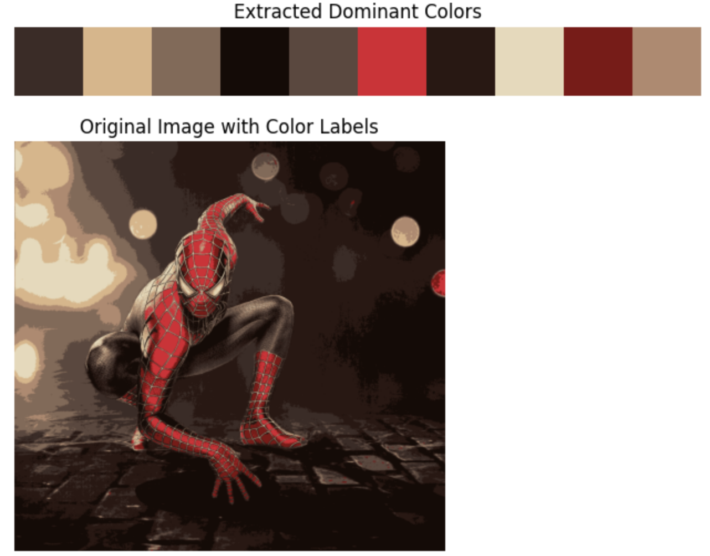
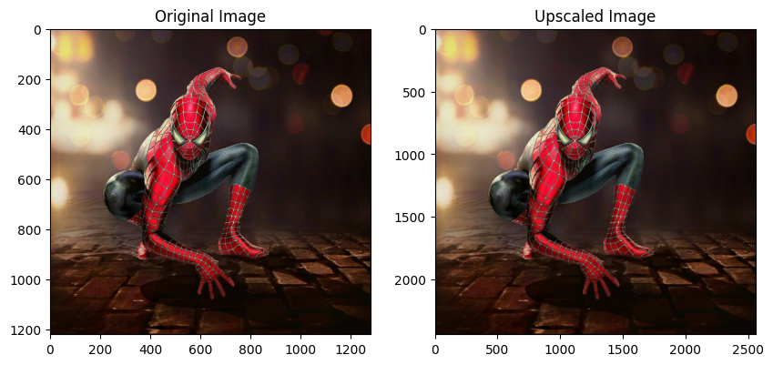

# Dominant Color Extraction and Image Upscaling

This notebook demonstrates two key image processing techniques:
1. **Dominant Color Extraction** using K-Means clustering
2. **Image Upscaling** with OpenCV

## Screenshots





## Prerequisites

Make sure you have the following Python packages installed:

- `Pillow` (for image processing)
- `numpy` (for numerical operations)
- `matplotlib` (for plotting)
- `scikit-learn` (for K-Means clustering)
- `opencv-python` (for image upscaling)
- `google.colab` (for mounting Google Drive, optional)

You can install these packages using pip if they are not already installed:

```bash
pip install pillow numpy matplotlib scikit-learn opencv-python
```

## Dominant Color Extraction

### Description

This section shows how to extract and visualize the dominant colors from an image using K-Means clustering.

### Steps

1. **Mount Google Drive (optional):**

   If your image is stored in Google Drive, mount it using the following code:

   ```python
   from google.colab import drive
   drive.mount('/content/drive')
   ```

   Update the `image_path` variable with the path to your image file. For example:

   ```python
   image_path = '/content/drive/MyDrive/spiderman.jpg'
   ```

2. **Load and Process the Image:**

   Load the image and convert it to a NumPy array:

   ```python
   from PIL import Image
   import numpy as np

   image_path = 'spiderman.jpg'
   img = Image.open(image_path)
   img_array = np.array(img)
   ```

3. **Apply K-Means Clustering:**

   Perform K-Means clustering to identify dominant colors:

   ```python
   from sklearn.cluster import KMeans

   w, h, d = img_array.shape
   pixels = img_array.reshape((w * h, d))
   n_colors = 10  # Number of dominant colors to extract

   kmeans = KMeans(n_clusters=n_colors, random_state=42).fit(pixels)
   dominant_colors = kmeans.cluster_centers_
   ```

4. **Visualize the Extracted Colors:**

   Display the extracted dominant colors:

   ```python
   import matplotlib.pyplot as plt

   palette = dominant_colors.astype(np.uint8)

   plt.figure(figsize=(8, 6))
   plt.imshow([palette])
   plt.axis('off')
   plt.title('Extracted Dominant Colors')
   plt.show()
   ```

5. **Label the Image (Optional):**

   Label each pixel in the image with its corresponding dominant color:

   ```python
   def label_image(image, dominant_colors, labels):
       labeled_image = np.zeros_like(image)
       for i in range(image.shape[0]):
           for j in range(image.shape[1]):
               label = labels[i, j]
               labeled_image[i, j] = dominant_colors[label]
       return labeled_image

   labels = kmeans.labels_.reshape((w, h))
   labeled_img = label_image(img_array.copy(), dominant_colors, labels)

   plt.imshow(labeled_img)
   plt.axis('off')
   plt.title('Original Image with Color Labels')
   plt.show()
   ```

## Image Upscaling

### Description

Image upscaling increases the resolution of an image, making it appear larger and sharper. This can be done using various techniques:

- **Nearest Neighbor Interpolation**: Simple but often results in pixelated images.
- **Bilinear Interpolation**: Uses a weighted average of neighboring pixels.
- **Bicubic Interpolation**: Higher-quality method using cubic polynomials.
- **Deep Learning-based Methods**: Leverages neural networks for high-quality results.

### Using OpenCV for Image Upscaling

Here’s how to upscale an image using OpenCV:

```python
import cv2
import matplotlib.pyplot as plt

# Load the image
img = cv2.imread('your_image.jpg')

# Upscale the image using bilinear interpolation
upscaled_img = cv2.resize(img, (0, 0), fx=2, fy=2, interpolation=cv2.INTER_LINEAR)

# Display the original and upscaled images
plt.figure(figsize=(10, 5))
plt.subplot(1, 2, 1)
plt.imshow(cv2.cvtColor(img, cv2.COLOR_BGR2RGB))
plt.title('Original Image')
plt.subplot(1, 2, 2)
plt.imshow(cv2.cvtColor(upscaled_img, cv2.COLOR_BGR2RGB))
plt.title('Upscaled Image')
plt.show()
```

### Explanation

- **Import Libraries**: Import `cv2` for OpenCV functions and `matplotlib.pyplot` for visualization.
- **Load Image**: Use `cv2.imread()` to load the image.
- **Upscale Image**: Use `cv2.resize()` to increase the image size. The `fx` and `fy` parameters control scaling in the x and y directions, respectively. `cv2.INTER_LINEAR` is used for bilinear interpolation.
- **Display Images**: Use `plt.imshow()` to show both the original and upscaled images.

### Additional Considerations

- **Deep Learning Methods**: For advanced upscaling, explore models like SRGAN or ESRGAN for improved results.
- **Image Quality Metrics**: Evaluate upscaled images using metrics like Peak Signal-to-Noise Ratio (PSNR) or Structural Similarity Index (SSIM).
- **Other Interpolation Methods**: Experiment with interpolation methods like bicubic (`cv2.INTER_CUBIC`) or Lanczos (`cv2.INTER_LANCZOS4`) for different quality and speed trade-offs.

## License

This project is licensed under the MIT License. See the [LICENSE](LICENSE) file for details.

## Contact

For any inquiries or issues, please contact me!

## Author

- **Worachat W, Dev.** - *Data Science, Engineering & Full Stack Dev. 2024*  
  [LinkedIn](https://www.linkedin.com/in/brainwaves-your-ai-playground-82155961/) | [GitHub](https://github.com/worachat-dev) | [Facebook](https://web.facebook.com/NutriCious.Thailand)

---

